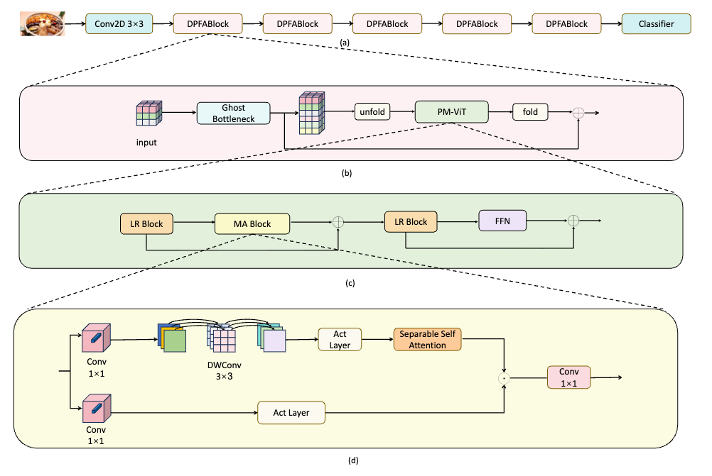

# DPFA-Net
## Abstract
Food image recognition holds significant application potential in the field of computer vision. However, due to performance constraints on mobile devices, the scale and computational overhead of models face notable limitations, making effective deployment on mobile platforms challenging. To address this issue, this paper proposes a lightweight Dual-Path Feature Aggregation Network (DPFA-Net), designed to enhance the performance of food recognition tasks through efficient local and global feature extraction strategies. Specifically, the DPFA architecture comprises two core modules: the GhostBottleneck module for local feature encoding and the Position Mamba Vision Transformer (PM-ViT) module for global modeling. In this work, the GhostBottleneck module is utilized to extract local features from images. Furthermore, by integrating the Mamba structure with the Separable Self-Attention (SSA) structure, we construct the Mamba Attention (MA) module, which replaces the traditional Attention mechanism in Vision Transformers to build the PM-ViT module, enabling the capture of global features in food images. The redesigned DPFA-Net effectively fuses local and global information, achieving efficient food image recognition. The experiments were conducted on the ETHZ Food-101, Vireo Food-172, and UEC Food-256 datasets. The results show that, while reducing the number of parameters, DPFA-Net achieved Top-1 accuracies of 91.46%, 91.59%, and 75.33%, respectively, representing a 1.50%–3.9% improvement over MobileViTv2. Compared to MobileViTv2, DPFA-Net improves performance by 1.50%-3.9%, fully validating the effectiveness and superiority of the DPFA architecture.

## Network structure


## Citation
```
@article{zhu2026dpfa,
  title={DPFA-net: a lightweight hybrid neural network with dual path feature aggregation for food image recognition},
  author={Zhu, Xiangyi and Zhang, Wenli and Sheng, Yingnan and Lv, Congrui and Sheng, Guorui and Min, Weiqing and Jiang, Shuqiang},
  journal={Multimedia Systems},
  volume={32},
  number={2},
  pages={80},
  year={2026},
  publisher={Springer}
}
```
